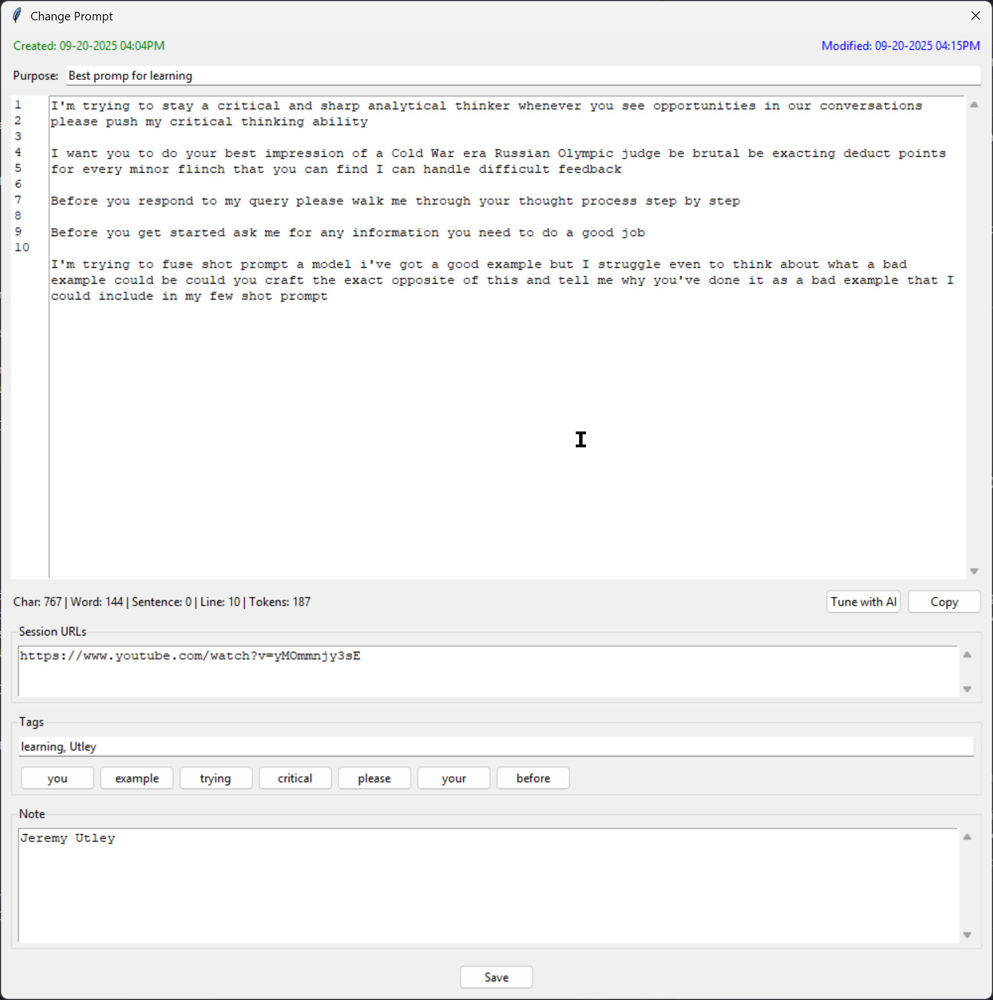

# prompt_mini

> A powerful, local-first desktop application for managing and refining your AI prompts.

Prompt Mini is a desktop application for creating, managing, and refining AI prompts. Built with Python and Tkinter, it uses a local SQLite database with full-text search for fast access to your prompt library. It integrates directly with major AI APIs to help tune and improve prompts, and includes robust exporting options, backup/restore/import, and detailed prompt statistics.

---

## Key Features

* **Centralized Prompt Library**: Store and organize all your prompts in a single, local SQLite database. No cloud dependency.
* **Powerful Full-Text Search**: Instantly find any prompt using SQLite's FTS5 module, with support for complex queries.
* **Tune with AI**: Integrate directly with APIs from Google, OpenAI, Anthropic, Cohere, Groq, HuggingFace, and OpenRouterAI to refine and improve your prompts.
* **Rich Metadata**: Enhance prompts with a purpose, clickable tags, session URLs, and detailed notes.
* **Detailed Statistics**: Get instant counts for characters, words, sentences, lines, and estimated tokens for any prompt.
* **Data Portability**: Export single prompts, search results, or the entire library to CSV, PDF, TXT, and DOCX formats.
* **Safe & Secure**: Includes simple one-click backup and restore functionality for your entire prompt database.

---

## Building from Source

The application is built using a batch script that automates the setup process.

1.  **Prerequisite**: Ensure you have Python installed and accessible from your system's PATH. [cite: 1]
2.  **Run the Build Script**: Execute `build.bat`.

The script will perform the following actions:
* Verify your Python installation.
* Install `PyInstaller` if it is not already present.
* Install all required Python libraries, including `pandas`, `reportlab`, `python-docx`, `wordcloud`, `requests`, and `huggingface_hub`.
* Use PyInstaller to package the application into a single, standalone executable. 

Upon successful completion, the executable will be located at `dist\PromptMini.exe`.

---

## Usage

* **Main Window**: The main interface displays a search bar at the top, a list of search results on the left, and a detailed view of the selected prompt on the right.
* **Searching**: Type keywords into the search bar. The results update automatically. Leave the bar empty to view all prompts.
* **Managing Prompts**: Use the "New Prompt", "Change", "Duplicate", and "Delete" buttons to manage your library.
* **AI Tuning**: Select a prompt and click "Tune with AI" to open a new window where you can send the prompt to a selected AI model for refinement. API keys must be provided in this window for it to function.

